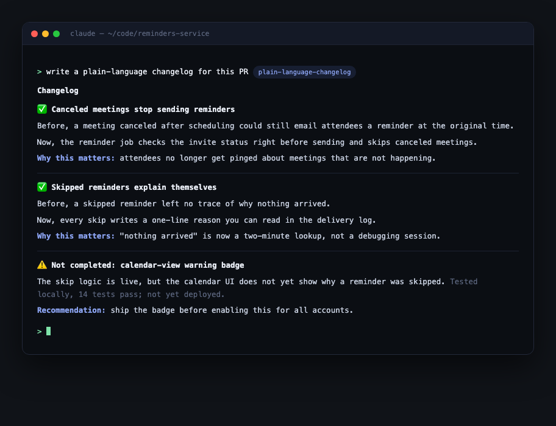

# plain-language-changelog

An agent skill for Claude Code and Codex that turns technical changes into release notes a non-engineer can act on.



Point it at a PR, a worktree, or a finished investigation and it produces a changelog built on Before / Now / Why-this-matters framing, with honest labels for what is tested, what is deployed, and what is still unproven.

## Why

Most changelogs are written for the people who made the change. The person deciding whether to ship it, announce it, or build on it usually is not one of them. This skill writes for that second person without losing the first one's trust.

- **Operators read it, engineers trust it.** Plain cause-and-effect language, but every claim is separated into implemented / tested locally / verified in CI / deployed / still unproven. No overclaiming, ever.
- **Before / Now / Why-this-matters framing.** Each change states the old behavior, the new behavior, and the impact in three short paragraphs. Jargon gets translated ("route lookup" becomes "finding the right recipient list"), not just deleted.
- **The unfinished half gets equal billing.** Blocked work, missing frontend counterparts, and risky assumptions get their own warning sections instead of a buried footnote, so nobody ships half a feature by accident.
- **Ends with a move.** Every changelog closes with a recommendation and concrete next steps, not just a list of diffs.

## Install

```bash
git clone https://github.com/aviju888/plain-language-changelog.git
```

Claude Code:

```bash
mkdir -p ~/.claude/skills/plain-language-changelog
cp plain-language-changelog/SKILL.md ~/.claude/skills/plain-language-changelog/
```

Codex:

```bash
mkdir -p ~/.codex/skills/plain-language-changelog
cp -R plain-language-changelog/SKILL.md plain-language-changelog/agents ~/.codex/skills/plain-language-changelog/
```

## Use

Activates whenever you ask your agent to explain what changed in plain language:

```
write a plain-language changelog for this PR
explain what this worktree implements for a non-technical operator
turn this into customer-friendly release notes
summarize what shipped this week for the team update
```

The output follows a fixed shape: checkmarked sections per completed change (Before / Now / Why this matters), warning sections for anything unfinished or unproven, tests and proof artifacts in human terms, and a closing recommendation. Point it at whatever context you have: a diff, a branch, a PR description, or just the conversation where the work happened.

It also runs a content checklist before finishing: original problem, behavior before and after, guardrails, diagnostics, tests run, what is out of scope, and suggested next steps. If a section does not apply, it is dropped rather than padded.

## License

MIT
